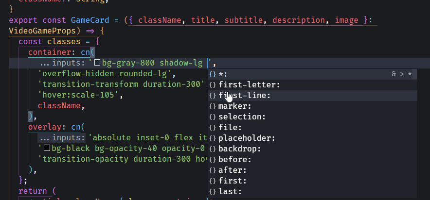

# React + TypeScript + Vite + Tailwind CSS + Personal Workflow Enhancements

This repository is a fork of Gentleman Programming's original project, which showcases best practices for using **Tailwind CSS**, **React**, **TypeScript**, and **Vite**. In this fork, I have restructured and extended the project to reflect my personal workflow, demonstrating how I approach creating scalable, maintainable, and reusable applications with these technologies.

This enhanced version serves as both a learning tool and a practical example of modern development practices, providing insight into how I streamline my development process with tools like **Prettier**, **VS Code configurations**, and utility-driven design.

---

## Enhancements and Changes 🛠️

### **1. Prettier Configuration**

- Added a custom `prettier.config.mjs` file with support for `prettier-plugin-tailwindcss`, ensuring consistent formatting and proper Tailwind class sorting.
- Key configurations:
  - `tailwindConfig` and `tailwindFunctions` set to handle custom class combinations.

### **2. VS Code Workspace Configuration**

- Introduced `.vscode/extensions.json` for recommended extensions:

  - Prettier, ESLint, Tailwind CSS IntelliSense, and more.

  - Added `.vscode/settings.json` for improved Tailwind CSS class detection:

    <details>
      <summary>Class Detection Preview</summary>
      
    </details>

- Added `.vscode/settings.json` for improved Tailwind CSS class detection.

### **3. Component Refactorings**

- **GameCard Component:**
  - Migrated from `VideoGamesGameItem.tsx` to `src/components/Cards/GameCard/GameCard.tsx`.
  - Enhanced with dynamic class utilities (`cn` function), hover effects, and improved visuals.
- **GridLayout Component:**
  - Generalized `VideoGameGrid` to `GridLayout` in `src/layouts/GridLayouts.tsx` for reusable grid-based layouts.
  - Supports dynamic rendering of grid items with a title and customizable classes.

### **4. Utility Additions**

- **cn.ts Utility:**
  - Added `src/utils/cn.ts` for managing dynamic Tailwind CSS classes using `clsx` and `twMerge`.

### **5. Global Styles Optimization**

- Simplified `index.css`:
  - Removed redundant styles for components now managed within React files.
  - Retained essential global styles for typography and layout consistency.

---

## Installation

To get started:

1. Clone this repository:

   ```sh
   git clone https://github.com/Zyruks/Tailwind-Good-Practices
   ```

2. Install dependencies:

   ```sh
   bun install
   ```

3. Run the development server:

   ```sh
   bun run dev
   ```

---

## Updated Best Practices 🚀

This project follows Gentleman Programming's original philosophy with enhancements to embrace scalability and maintainability:

### **1. Utility-First Approach**

- Leveraged Tailwind CSS's utility classes directly in JSX for cleaner and reusable code.

### **2. Component-Level Styles**

- Moved styles to individual components instead of relying on global CSS.

### **3. Prettier Integration**

- Configured Prettier for consistent formatting and Tailwind class sorting.

### **4. Generalized Layouts**

- Abstracted grid-based layouts into a reusable `GridLayout` component.

### **5. Improved Project Structure**

- Organized files into logical directories (`components`, `utils`, `layouts`).
